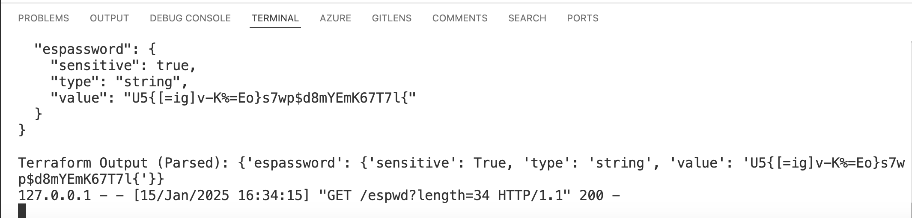
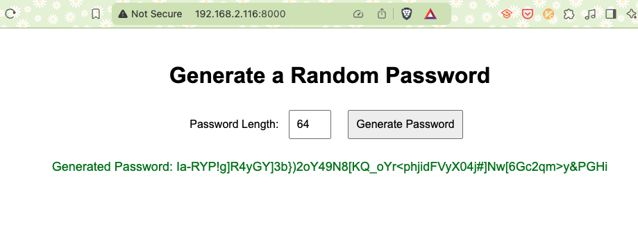
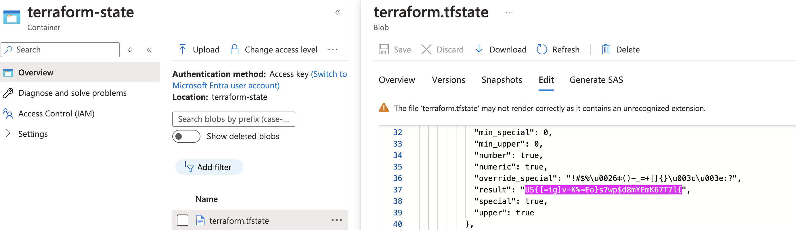

# Create a random password with the following requirements:
  * Length: 18 default value
  * To change the length, use the following command:
    - export TF_VAR_length=20 in the shell changing the lenght will regenerate the password

## Can also be done using the following command: terraform apply -var 'length=20' -auto-approve
  * Alphanumeric characters: a-z, A-Z, 0-9
  * Special characters: !#$%&*()-_=+[]{}<>:?
  * Output the password as a sensitive output

### Terraform command sequence:
```
terraform init
terraform apply -auto-approve
terraform output espassword
```
## Command variations:

```
terraform apply -auto-approve -var length=10; terraform output espassword
terraform apply -auto-approve -var length=255; terraform output espassword
```

**Every run will generate a new password and store it in the Azure storage account as part of the state.**
**The storage account have versioning enabled, so you can always revert to a previous the password if needed.**

## To run as a webservice on your local Machine (I do on my Mac):


 ```
 python pwd.py
 python -m http.server 8000 --bind <your IP>
```

## How does it look like

**python pwd.py**


**Run as a webserver to generate passwords**
**python -m http.server 8000 --bind <your own local IP>**


**Gets stored on the Azure storage account**



 **Roberto**
